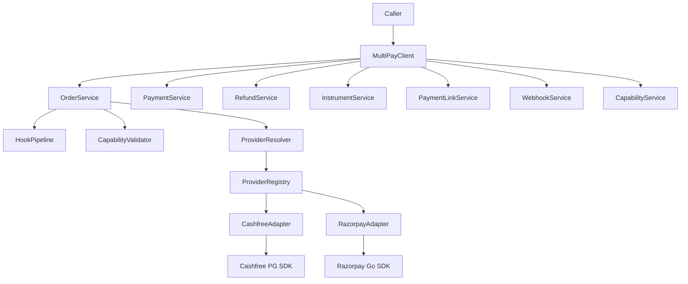
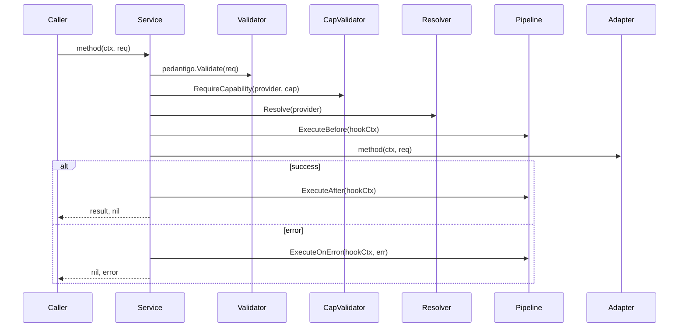
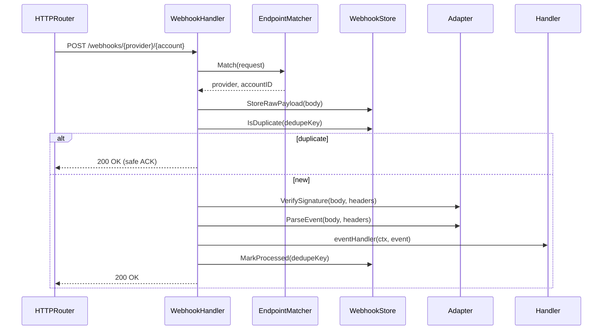
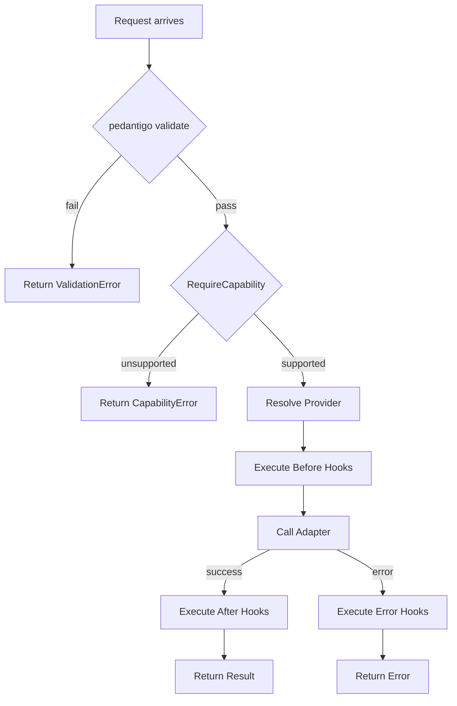
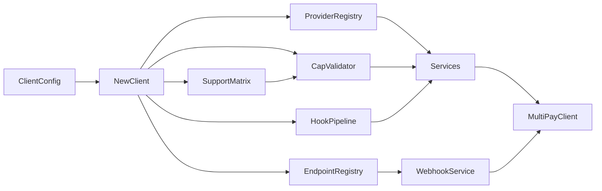

# MultiPay Adapter — Design Document

This document describes the architecture, design decisions, and core concepts of the MultiPay Adapter library.

## Architecture Overview



**Explanation**: The MultiPayClient is the main entry point that callers interact with. It wraps 8 orchestration services (Orders, Payments, Refunds, Instruments, Payment Links, Webhooks, Capabilities, and Audit) that use a consistent pipeline of hooks, capability validation, and provider resolution to dispatch requests to payment provider adapters (Cashfree or Razorpay). These adapters wrap the official SDKs from each provider.

## Hook Pipeline Flow



**Explanation**: Every service method follows a consistent, predictable flow:

1. **Validate**: Request is validated using pedantigo struct validators
2. **Capability Check**: The requested provider's capability is verified
3. **Provider Resolution**: The appropriate adapter is resolved from the registry
4. **Before Hooks**: Registered before-hooks execute (e.g., audit, metrics collection)
5. **Provider Call**: The adapter method is invoked with the validated request
6. **After/Error Hooks**: Success triggers after-hooks; errors trigger error-hooks
7. **Return**: Result or error is returned to caller

This pipeline ensures consistent behavior across all operations: validation happens first, hooks are predictable, and errors are handled uniformly.

## Webhook Routing Flow



**Explanation**: Webhook processing follows a robust 8-step flow designed for idempotency and reliability:

1. **Match Endpoint**: Extract provider and account ID from URL path
2. **Store Raw Payload**: Save the raw webhook body immediately for audit and recovery
3. **Check Duplicates**: Use a deduplication key (provider + transaction ID) to detect replayed webhooks
4. **Safe ACK for Duplicates**: If duplicate detected, immediately ACK with 200 OK (provider won't retry)
5. **Verify Signature**: Validate webhook signature using provider's public key
6. **Parse Event**: Deserialize the webhook body into a typed event struct
7. **Dispatch Handler**: Call the registered event handler with the parsed event
8. **Mark Processed**: Record successful processing in the deduplication store

This design ensures that even if a webhook is delivered multiple times, the handler is called exactly once.

## Capability Matrix Decision Tree



**Explanation**: The capability matrix is a critical control point in the request flow:

- **Early Validation**: Requests are validated using pedantigo before any provider-specific logic
- **Capability Check**: Every operation checks if the resolved provider supports the requested capability
- **Fail Fast**: Unsupported capabilities immediately return a CapabilityError, preventing wasted work
- **Graceful Degradation**: Callers can catch CapabilityError and fall back to alternative flows
- **Audit Trail**: Before/error hooks log all capability decisions, creating a complete audit trail

This design allows callers to query capabilities upfront, or attempt operations and handle CapabilityError gracefully.

## Dependency Injection and Construction Flow



**Explanation**: The MultiPayClient is constructed from a ClientConfig in a deterministic flow:

1. **Parse Config**: ClientConfig is validated and contains adapter credentials for all providers
2. **Create Support Matrix**: Based on adapters enabled in config, build a capability matrix
3. **Create Capability Validator**: Uses the support matrix to validate operations
4. **Create Provider Registry**: Maps provider names to adapter instances
5. **Create Hook Pipeline**: Initializes before-hook and after-hook chains
6. **Create Endpoint Registry**: Maps webhook endpoints to handlers
7. **Create Services**: All 8 services are instantiated with shared dependencies
8. **Return Client**: The fully-constructed MultiPayClient is returned

This dependency graph ensures that all dependencies are available before any service is used, and shared components (like the hook pipeline) are reused across services.

## Core Design Principles

### 1. Canonical Types

All request and response types are defined once in the library and used everywhere. Providers return provider-specific types (e.g., Cashfree Order), which are immediately mapped to canonical types (Order) at the adapter boundary. This ensures consistent APIs across providers and simplifies testing.

### 2. Error Handling

- **Sentinel Errors**: Expected errors (e.g., OrderNotFound, RefundAlreadyProcessed) are sentinel errors that can be checked with `errors.Is()`
- **Provider Errors**: Provider-specific errors are wrapped in ProviderAPIError with the original error preserved
- **Capability Errors**: Unsupported capabilities return CapabilityError with details about which capability is unsupported
- **Validation Errors**: pedantigo validation errors are returned as-is with structured field-level errors

### 3. Deduplication and Idempotency

- **Webhook Deduplication**: Raw webhook payloads are stored and checked for duplicates before processing
- **Idempotent Operations**: All operations are safe to retry; duplicate requests return the same result
- **Atomic Commits**: All state updates (deduplication, audit logs, metrics) are committed atomically

### 4. Hook Pipeline

- **Before Hooks**: Execute before the provider call; useful for audit, metrics setup, and request transformation
- **After Hooks**: Execute after successful provider call; useful for audit, metrics recording, cache invalidation
- **Error Hooks**: Execute when the provider call fails; useful for error audit, alerting, and recovery
- **Built-in Hooks**: Audit hook (logs all operations), metrics hook (records latency and status)
- **Custom Hooks**: Callers can register custom hooks for observability, cache invalidation, or business logic

### 5. Provider Adapter Interface

All adapters implement a common interface:

```
type Adapter interface {
    // Order operations
    CreateOrder(ctx context.Context, req *Order) (*Order, error)
    FetchOrder(ctx context.Context, id string) (*Order, error)
    ListOrderPayments(ctx context.Context, id string) ([]*Payment, error)

    // Payment operations
    FetchPayment(ctx context.Context, id string) (*Payment, error)
    ListPayments(ctx context.Context, filters ...) ([]*Payment, error)
    CapturePayment(ctx context.Context, paymentID, amount) (*Payment, error)

    // Refund operations
    CreateRefund(ctx context.Context, req *RefundRequest) (*Refund, error)
    FetchRefund(ctx context.Context, id string) (*Refund, error)
    ListRefunds(ctx context.Context, filters ...) ([]*Refund, error)

    // Instrument operations
    FetchInstrument(ctx context.Context, id string) (*Instrument, error)
    ListInstruments(ctx context.Context, filters ...) ([]*Instrument, error)
    DeleteInstrument(ctx context.Context, id string) error

    // Payment Link operations
    CreatePaymentLink(ctx context.Context, req *PaymentLinkRequest) (*PaymentLink, error)
    FetchPaymentLink(ctx context.Context, id string) (*PaymentLink, error)
    CancelPaymentLink(ctx context.Context, id string) (*PaymentLink, error)

    // Webhook operations
    VerifySignature(ctx context.Context, body []byte, headers map[string]string) error
    ParseEvent(ctx context.Context, body []byte) (interface{}, error)

    // Capability reporting
    Supports(capability string) bool
}
```

All providers implement this interface, ensuring consistent APIs regardless of which provider is used.

### 6. Configuration and Multi-Account Support

- **ClientConfig**: Contains credentials for all enabled providers
- **Multi-Instance**: Callers can create multiple MultiPayClient instances, one per region or tenant
- **Thread-Safe**: All clients are fully thread-safe; no global state
- **Hot Reloading**: Some providers support credential reloading without restarting the client

### 7. Testing and Mocking

- **Interface-Based**: All components depend on interfaces, not concrete implementations
- **Mock Adapters**: A mock adapter implements the adapter interface and returns predictable test data
- **Mock Hooks**: Hooks can be mocked to verify that expected hooks were called
- **Mock Webhook Handlers**: Event handlers can be mocked to verify event routing

## Error Handling Strategy

### Sentinel Errors

Expected error conditions are represented as sentinel errors:

```go
var (
    ErrOrderNotFound           = errors.New("order not found")
    ErrRefundNotFound          = errors.New("refund not found")
    ErrPaymentNotFound         = errors.New("payment not found")
    ErrRefundAlreadyProcessed  = errors.New("refund already processed")
    ErrAmountExceedsRemaining  = errors.New("refund amount exceeds remaining balance")
)
```

Callers can check errors with:

```go
if errors.Is(err, ErrOrderNotFound) {
    // Handle not found case
}
```

### ProviderAPIError

When a provider API returns an error, it is wrapped in ProviderAPIError:

```go
type ProviderAPIError struct {
    Provider string      // "cashfree" or "razorpay"
    Code     string      // Provider-specific error code
    Message  string      // Human-readable message
    Err      error       // Original provider error
}
```

Callers can inspect provider-specific details while also checking for known error patterns:

```go
if errors.Is(err, ErrOrderNotFound) {
    // Handle missing order
} else if pe := &ProviderAPIError{}; errors.As(err, &pe) {
    // Handle provider-specific error
    log.Printf("Provider %s error: %s", pe.Provider, pe.Message)
}
```

### CapabilityError

When a provider doesn't support a requested operation:

```go
type CapabilityError struct {
    Provider    string     // "cashfree" or "razorpay"
    Capability  string     // "refund", "tokenization", etc.
    Reason      string     // Why it's not supported
}
```

Callers can gracefully degrade:

```go
_, err := client.CreateRefund(ctx, req)
if ce := &CapabilityError{}; errors.As(err, &ce) {
    // Fall back to manual refund flow
    return manualRefundFlow(ctx, order)
}
```

## Webhook Deduplication

Webhooks are deduplicated using a key composed of:

- **Provider**: Which provider sent the webhook (cashfree/razorpay)
- **Transaction ID**: The provider's transaction or order ID
- **Webhook Type**: The type of event (order.paid, refund.created, etc.)

The deduplication store (Redis, in-memory cache, or custom backend) is responsible for:

1. **Detecting Duplicates**: Check if deduplication key has been seen before
2. **Storing Raw Payloads**: Keep the raw webhook body for audit and debugging
3. **Recording Timestamps**: Track when each webhook was processed
4. **Expiring Entries**: Clean up old entries after 24 hours (configurable)

This ensures that even if a provider resends the same webhook multiple times (common during network issues), the event handler is called exactly once.

## Thread Safety

All components are fully thread-safe:

- **MultiPayClient**: Can be shared across goroutines
- **Services**: All methods are safe to call concurrently
- **Adapters**: All methods are safe to call concurrently
- **Hooks**: Hook handlers are called serially within a single request, but multiple requests are handled concurrently
- **Webhook Handler**: Safe to call from multiple HTTP handler goroutines

There are no global variables or shared mutable state. Each MultiPayClient owns its dependencies, and dependencies do not share state.

## Observability

The library provides built-in observability via hooks:

1. **Audit Hook**: Logs all operations (method, provider, duration, status)
2. **Metrics Hook**: Records latency histograms and status counters
3. **Tracing Hook**: Propagates OpenTelemetry trace context
4. **Custom Hooks**: Callers can add custom hooks for additional observability

All hooks are optional and can be disabled. The default configuration includes audit and metrics hooks.

## Security Considerations

1. **Signature Verification**: All webhooks are signature-verified using provider public keys
2. **Credential Isolation**: Provider credentials are never logged or included in audit trails
3. **HTTPS Only**: All provider API calls use HTTPS
4. **Input Validation**: All requests are validated using pedantigo before provider calls
5. **Output Sanitization**: Sensitive fields are not included in audit logs or metrics
6. **Rate Limiting**: Implemented at the client level to prevent overloading providers
