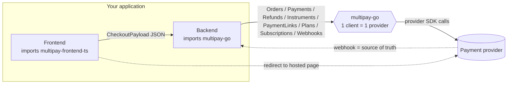
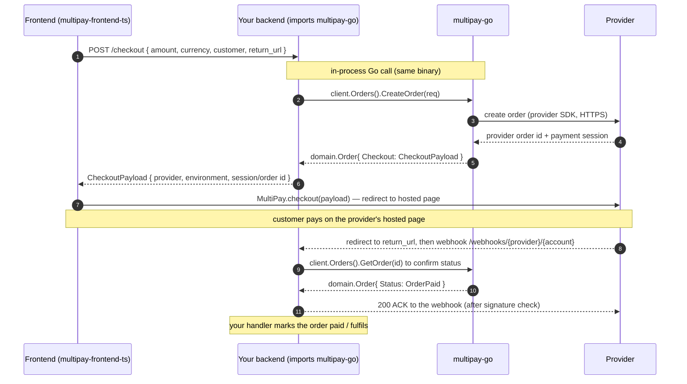
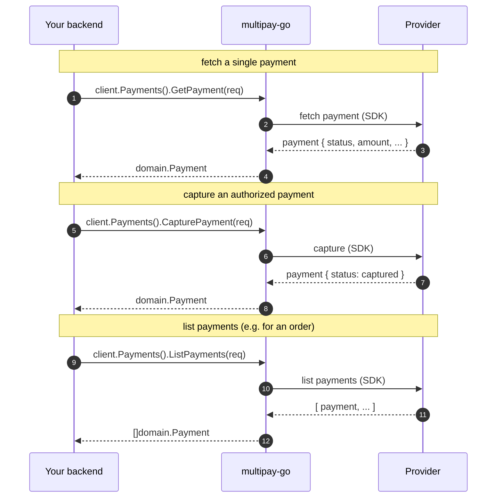
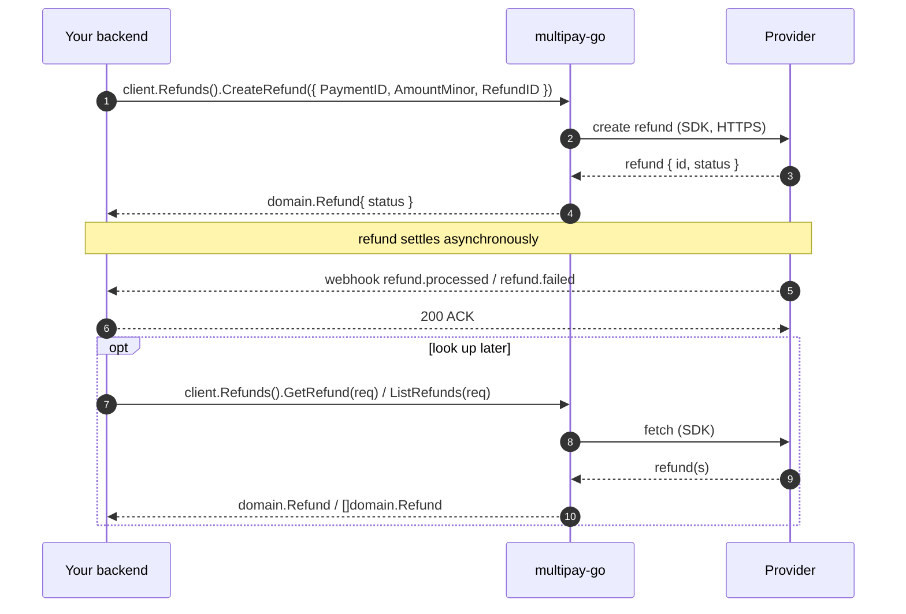
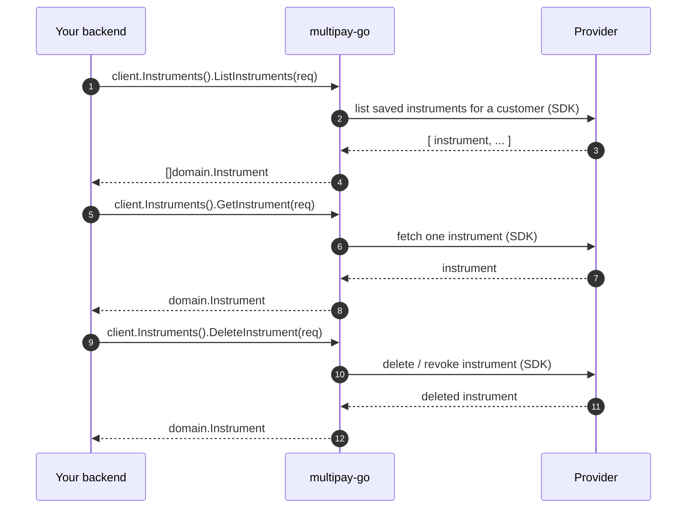
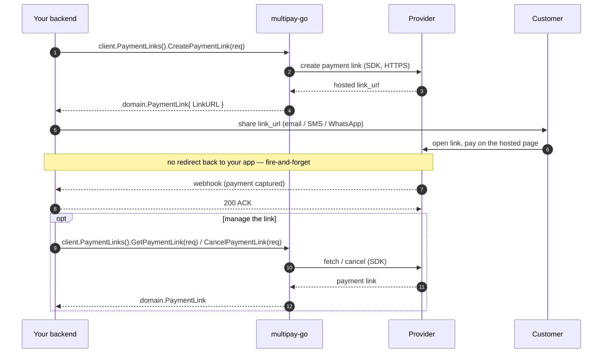
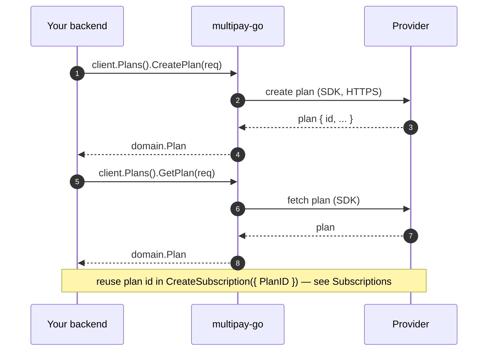
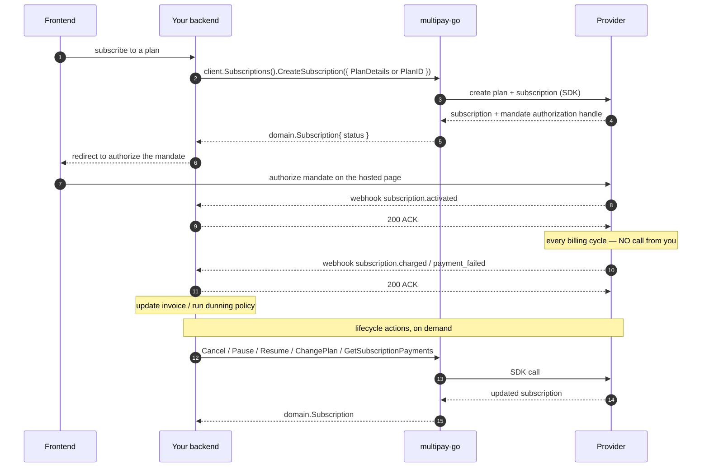
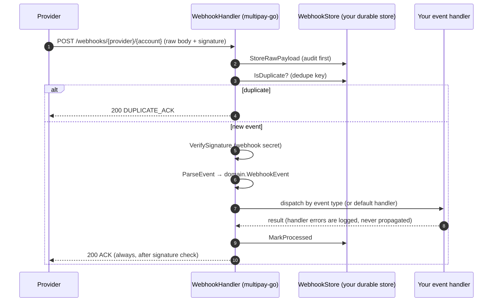
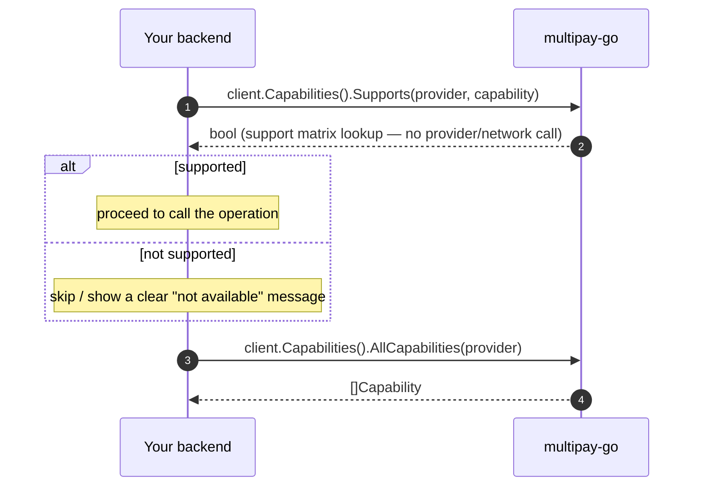

# Payment Flows

Sequence diagrams for every workflow `multipay-india` supports. These are **provider-neutral** — the same
flow holds whether the client is bound to Cashfree, Razorpay, or any future provider. Examples use the Go
port (`multipay-go`); the other language ports expose the same surface.

**Actors**

- **Frontend** — your UI (optionally using `multipay-frontend-ts` for the redirect/picker).
- **Backend** — your server, which imports `multipay-go`.
- **multipay-go** — the library. The backend → library call is an **in-process function call**, not a
  network hop.
- **Provider** — the payment gateway (Cashfree / Razorpay / …).

Two invariants worth repeating:

- **One client is bound to one provider** — chosen at construction, no runtime branching.
- **The webhook is the source of truth.** A post-payment browser redirect is UX; the webhook is what you
  trust. The handler must always answer `2xx` after the signature check, or the provider will auto-disable
  the endpoint.

> Field names shown in the diagrams (e.g. `{ amount, currency, customer }`) are illustrative. The exact
> request/response structs live in `multipay-go/domain` — see [`multipay-go/README.md`](./multipay-go/README.md).

---

## The big picture — who imports what

---

## 1. Standard checkout (orders)

Create an order, hand the typed `CheckoutPayload` to the frontend, redirect to the provider's hosted page.
The return redirect is UX; the webhook is the truth.

---

## 2. Payments (fetch, list, capture)

Inspect a payment, list the payments on an order, or capture a previously **authorized** payment (the
auth → capture two-step, when you authorize first and capture later).

---

## 3. Refunds

Refund a captured payment by its provider payment id. The refund settles asynchronously — its terminal state
arrives as a webhook.

---

## 4. Instruments (saved cards / mandate tokens)

List the instruments saved against a customer, fetch one, or delete/revoke one. The provider owns the
instrument lifecycle; the library is a typed window onto it.

---

## 5. Payment links

A hosted pay-now URL you share over email/SMS/WhatsApp — useful for recovery (abandoned cart, failed
renewal). No browser comes back to your app, so the webhook is the *only* thing that closes the loop.

---

## 6. Plans

Create or fetch a recurring **plan** (both providers are plan-first — a plan is created, then reused when
creating subscriptions). A plan id from here can be passed to `CreateSubscription({ PlanID })`.

---

## 7. Subscriptions (recurring billing)

Create once (with an inline plan or an existing plan id), the customer authorizes a mandate on the hosted
page, and then the provider auto-charges every cycle with **no call from you** — each charge arrives as a
webhook. Lifecycle actions are on-demand calls.

---

## 8. Webhook consumption (how every confirmation arrives)

The one flow the *provider* starts — and the source of truth behind every flow above. The library's
`WebhookHandler` runs a fixed, durable, idempotent pipeline and **always answers `2xx` after the signature
check**. A `5xx` would make the provider auto-disable your endpoint, so handler errors are logged and the
event is left in the store for replay, never bubbled up as a 5xx.

> **What you do with a confirmed webhook is yours, not the library's.** The library hands you a typed
> `domain.WebhookEvent`; turning that into "mark the order paid", "activate the subscription", "grant access",
> or "send a receipt" is entirely your application's business logic.

---

## 9. Capabilities (introspection guard)

Not a money flow — a synchronous, **in-memory** check against the immutable support matrix. Use it to gate a
provider-specific operation *before* you call it, so unsupported combinations fail fast with a clear error
instead of a surprise at the provider.

