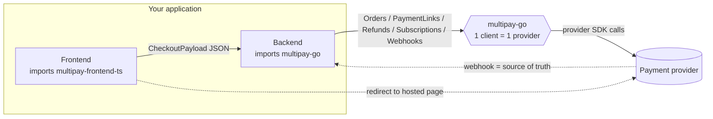

# multipay-india

`multipay-india` is a payment-gateway **aggregator** for Indian providers (Cashfree and Razorpay today,
PayU planned). The idea is simple: you write your checkout and billing code **once** against one canonical
API, and whether the money actually moves through Cashfree or Razorpay becomes a config detail rather than a
rewrite. The same contract is ported to several languages, so your Go backend, your TypeScript backend, and
your frontend all speak the exact same shapes.

## Providers supported:

| Provider | Implementation Status | Status |
|----------|------------|--------|
| CashFree | Implemented for Golang and Frontend | Testing WIP |
| RazorPay | Implemented for Golang and Frontend | Not Tested |
| PayU | TODO | TODO |

## How it works

The deal is simple: **your code talks to the library, and the library talks to the provider.** You build one
order, get back one typed "go pay now" payload, hand it to the frontend, and let the provider's own hosted
page collect the money. Then a webhook — *not* the browser redirect — tells you whether the payment actually
went through.

A few things worth knowing before the diagram:

- **One client is bound to one provider.** You choose Cashfree *or* Razorpay when you construct the client.
  There is no runtime "which provider?" branching scattered through your code.
- **The backend → library call is in-process.** `multipay-go` is a library you import, not a service you
  call over the network. The only real network hops are backend → provider (HTTPS), browser → hosted page
  (redirect), and provider → you (webhook).
- **The webhook is the source of truth.** The post-payment redirect is just UX ("show the user a result");
  the webhook is what you trust to move state. Your endpoint must always answer `2xx` after verifying the
  signature, or providers will auto-disable it.
- **Money is always in minor units** (paisa/cents) — see [Amounts](#amounts-are-always-in-minor-currency-units).

### The big picture — who imports what



## Workflows

The library exposes **nine first-class service surfaces** — orders, payments, refunds, instruments, payment
links, plans, subscriptions, webhooks, and a capability matrix. Each follows the same shape: you call a typed
method, the library calls the provider, you get a typed result back, and — for anything where money actually
moves — a **webhook** later confirms the real-world outcome.

**A sequence diagram for every one of these flows lives in [`PAYMENT_FLOWS.md`](./PAYMENT_FLOWS.md).**

> **What you do with a confirmed webhook is yours, not the library's.** The library hands you a typed
> `domain.WebhookEvent`; turning that into "mark the order paid", "activate the subscription", or "grant
> access" is your application's business logic.

## Layout

| Folder | What it is | Status |
|--------|-----------|--------|
| [`multipay-go/`](./multipay-go) | Go library (reference port) | Implemented |
| [`multipay-ts/`](./multipay-ts) | Backend TypeScript port | Planned |
| [`multipay-py/`](./multipay-py) | Backend Python port | Planned |
| [`multipay-frontend-ts/`](./multipay-frontend-ts) | Frontend checkout / picker library | Planned |
| [`contract/`](./contract) | Shared canonical contract + cross-language golden test vectors | Planned |

Every backend port exposes the same first-class surface — orders, payments, refunds, instruments, payment
links, plans, subscriptions, webhooks — and must stay in parity with `contract/`. See each folder's README
for language-specific details (e.g. [`multipay-go/README.md`](./multipay-go/README.md)).

## Build

A top-level dispatcher Makefile runs the same target across every language folder (placeholder ports are
skipped automatically):

```bash
make build    # build every implemented port
make lint     # lint every implemented port
make test     # test every implemented port
make check    # full pre-commit sequence per port
```

## Quick start (Go)

```go
import (
"context"

"github.com/Bytonomics/multipay-india/multipay-go/client"
"github.com/Bytonomics/multipay-india/multipay-go/domain"
"github.com/Bytonomics/multipay-india/multipay-go/providers/cashfree"
)

adapter, _ := cashfree.NewAdapter(&cashfree.Config{
ClientID:      "xxx",
ClientSecret:  "xxx",
WebhookSecret: "xxx",
Environment:   domain.EnvironmentSandbox,
})

mp, _ := client.NewClient(&client.ClientConfig{
Provider:     adapter,
WebhookStore: yourStore, // mandatory — durable webhook capture for dedup + replay
Logger:       yourLogger,
})

order, err := mp.Orders().CreateOrder(context.Background(), &domain.CreateOrderRequest{
AmountMinor: 50000, // ₹500.00 — always minor units
Currency:    "INR",
Customer:    &domain.CustomerInfo{CustomerID: "cust_1", Phone: "+919999999999"},
})
```

**Go Version Requirement**: Go 1.26 or later

## Amounts Are Always in Minor Currency Units

**All amounts in this library use `AmountMinor` (`int64`) — the smallest unit of the currency.**

This is the single most important API contract. Getting it wrong means charging 100x too little or too much.

| Currency | Minor Unit | 1 Major Unit | To charge ₹500 / $500 / ¥500 |
|----------|-----------|-------------|-------------------------------|
| INR | paisa | 100 paisa = ₹1 | `AmountMinor: 50000` |
| USD | cent | 100 cents = $1 | `AmountMinor: 50000` |
| EUR | cent | 100 cents = €1 | `AmountMinor: 50000` |
| JPY | yen | 1 yen = ¥1 (no subdivision) | `AmountMinor: 500` |
| BHD | fils | 1000 fils = 1 BHD | `AmountMinor: 500000` |
| KWD | fils | 1000 fils = 1 KWD | `AmountMinor: 500000` |

```go
// CORRECT — charge ₹500.00
order, err := client.Orders().CreateOrder(ctx, &domain.CreateOrderRequest{
AmountMinor: 50000,  // 50000 paisa = ₹500.00
Currency:    "INR",
// ...
})

// WRONG — this charges ₹5.00, not ₹500!
order, err := client.Orders().CreateOrder(ctx, &domain.CreateOrderRequest{
AmountMinor: 500,    // 500 paisa = ₹5.00
Currency:    "INR",
// ...
})

// CORRECT — charge ¥500 (JPY has no minor unit)
order, err := client.Orders().CreateOrder(ctx, &domain.CreateOrderRequest{
AmountMinor: 500,    // 500 yen = ¥500 (exponent 0)
Currency:    "JPY",
// ...
})
```

The library handles provider-specific conversion internally:
- **Cashfree** receives amounts in major units (rupees/dollars) — the library converts using ISO 4217 exponents via `bojanz/currency`
- **Razorpay** receives amounts in minor units (paisa/cents) — no conversion needed

You never need to worry about provider differences. Just pass `AmountMinor` consistently.


Full Go API, DI contract, and webhook details: [`multipay-go/README.md`](./multipay-go/README.md).

## License

A single repo-wide [`LICENSE`](./LICENSE) governs the whole monorepo.
