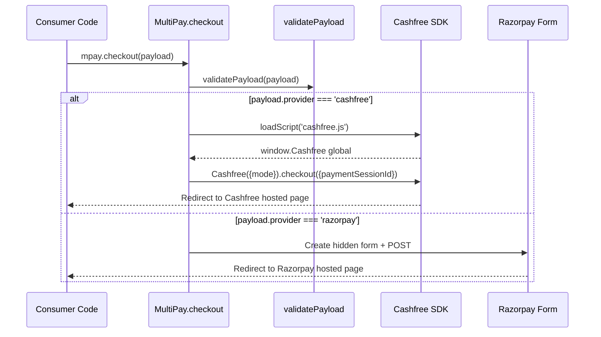
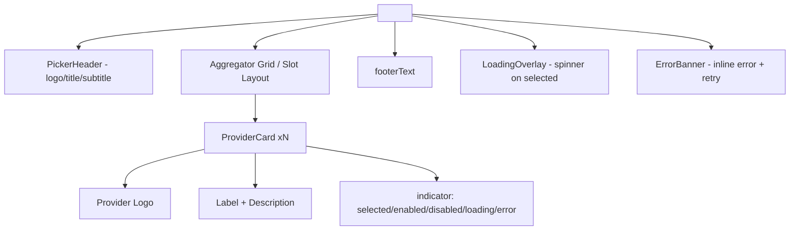

# CLAUDE.md

This file provides guidance to Claude Code (claude.ai/code) when working with code in the `multipay-frontend-ts` TypeScript library.

## What This Project Is

`multipay-frontend-ts` is a TypeScript/React npm library that provides two independent features:

1. **Headless checkout** (`@bytonomics/multipay-frontend-ts/core`) — `MultiPay.checkout(payload)` redirects to the vendor's hosted payment page. Zero React — usable from vanilla JS, Vue, Angular, Svelte, or React.
2. **Picker micro-UI** (`@bytonomics/multipay-frontend-ts/react`) — `<PaymentPicker>` React component for aggregator selection with 4 visual variants, light/dark theming, and loading/error states. React 18+ is an **optional** peer dependency.

The library is a **dependency** (imported by frontend apps), not a standalone application.

---

## Build, Test, and Lint Commands

**Never run `npm` commands directly. Always use Makefile targets.**

```bash
make help           # Show all targets with descriptions
make build          # Build ESM + CJS + type declarations via rollup
make typecheck      # Strict TypeScript check (tsc --noEmit)
make lint           # ESLint (strict, no any, exhaustive deps)
make test           # Unit tests (vitest + testing-library/react)
make check          # Full pre-commit sequence: typecheck -> lint -> test
make clean          # Remove build artifacts
```

### Pre-commit Hooks

Pre-commit runs one TypeScript hook: `frontend-ts-check` (typecheck + lint + test).

---

## Architecture

### Two Independent Entry Points

```mermaid
graph TD
    Consumer[Frontend App] --> |No React| CoreHeadless['@bytonomics/multipay-frontend-ts/core']
    Consumer --> |React 18+| ReactPicker['@bytonomics/multipay-frontend-ts/react']
    
    CoreHeadless --> |'mpay.checkout(payload)'| Checkout['MultiPay.checkout']
    Checkout --> Validate['validatePayload']
    Checkout --> CashfreeRedirect['cashfree.checkout']
    Checkout --> RazorpayRedirect['form POST']
    
    ReactPicker --> |Component| PickerUI['<PaymentPicker>']
    PickerUI --> State['usePaymentPicker hook']
    PickerUI --> CoreHeadless
```

The `/core` entry point has **zero React dependencies** — pure TypeScript that can run in any environment. The `/react` entry point pulls React as an optional peer dependency only when the picker component is needed.

### Package Exports Map

```json
{
  "exports": {
    ".":            { "import": "./dist/core/index.js",  "types": "./dist/core/index.d.ts" },
    "./core":       { "import": "./dist/core/index.js",  "types": "./dist/core/index.d.ts" },
    "./react":      { "import": "./dist/react/index.js", "types": "./dist/react/index.d.ts" },
    "./styles.css": "./dist/react/styles.css"
  },
  "peerDependencies":     { "react": ">=18", "react-dom": ">=18" },
  "peerDependenciesMeta": { "react": { "optional": true }, "react-dom": { "optional": true } }
}
```

A non-React app imports only `/core` and never loads React. Only consumers of `/react` need React present.

### Checkout Flow (Headless)



### Picker Component Structure



All variants share the same internal components; only the layout and CSS change per `variant` prop.

---

## Key Design Decisions

### Strict Typing, No `any`

Like the Go `multipay-go` library, this TypeScript library is strictly typed — **no `any`**, no implicit `any`, no untyped fields. Where an external library or browser global forces weak types (the Cashfree CDN global, JSON parsed from a backend response), declare a typed `interface` and convert at the boundary with a single explicit `as unknown as <Interface>` cast — never `any`. `tsconfig` runs in `strict` mode and ESLint bans `any`.

### Strongly-Typed Boundaries

```typescript
// ❌ WRONG — untyped global access
const cf = (window as any).Cashfree

// ✅ CORRECT — typed boundary with single explicit cast
interface CashfreeGlobal {
  Cashfree(opts: { mode: 'production' | 'sandbox' }): CashfreeInstance
}
const cf = (window as unknown as CashfreeGlobal).Cashfree({ mode })
```

The only place `as unknown as` is allowed is at the **boundary** where untyped data enters the codebase.

### Discriminated Unions for Provider Payloads

TypeScript's discriminated unions provide compile-time narrowing:

```typescript
type CheckoutPayload = CashfreeCheckoutPayload | RazorpayCheckoutPayload

function checkout(payload: CheckoutPayload) {
  switch (payload.provider) {
    case 'cashfree':
      // TypeScript knows payload.session_id exists here
      payload.session_id
      break
    case 'razorpay':
      // TypeScript knows payload.order_id, public_key, etc. exist here
      payload.order_id
      payload.public_key
      break
  }
}
```

Runtime validation (`validatePayload`) catches malformed payloads from dynamic sources (backend API responses).

### Provider vs PickerProviderId Types

Two separate types prevent accidental misuse:

```typescript
// Provider = canonical PAYABLE providers — values match Go domain enum exactly
type Provider = 'cashfree' | 'razorpay'

// PickerProviderId = picker-only superset — 'payu' is a future placeholder with NO Go provider
type PickerProviderId = Provider | 'payu'
```

- `CheckoutPayload.provider` is `Provider` — only 'cashfree' or 'razorpay'
- `ProviderOption.id` is `PickerProviderId` — can include 'payu' for placeholder
- `onSelect` callback emits `Provider` — only enabled canonical providers, never 'payu'
- PayU is **code-only placeholder** for now — not shown on the UI, never emitted by `onSelect`

### Enum Casing Matches Go Enums

- `Provider` values are **lowercase** — 'cashfree', 'razorpay' (matches Go domain enum)
- `Environment` values are **UPPERCASE** — 'SANDBOX', 'PRODUCTION' (matches Go domain enum)

This ensures the TypeScript library's contract exactly matches the Go `CheckoutPayload` serialization.

### PayU is UI-Only Placeholder

PayU is included in `PickerProviderId` as a future placeholder, but:

- **NOT shown in default `providers` array** — omitted from the set, not rendered
- **Always `enabled: false`** when manually added — visible but greyed, not clickable
- **Never emitted by `onSelect`** — only canonical `Provider` values ('cashfree', 'razorpay')
- **NOT part of `CheckoutPayload`** — no Go provider, no checkout implementation

This allows the code to support PayU later without breaking the API contract.

### Modular Props (PaymentPickerProps)

The picker props are split into two objects:

```typescript
interface PaymentPickerProps {
  payment: PaymentData          // DATA: order amount + providers + defaultSelected
  appearance?: PickerAppearance // STYLE: variant/theme/branding/taxNote/className
  onSelect: (provider: Provider) => void | Promise<void>
}
```

This separation makes it clear which props affect **what** is being charged (`payment`) versus **how** the picker looks (`appearance`).

### Four Picker Variants, All Web-First

All four variants (`dynamic-stack`, `interactive-matrix`, `secure-vault`, `neumorphic-flow`) are:

- **Web-first** — designed for desktop/mobile browsers, not native apps
- **Responsive** — adapt from 1-up (mobile) to 2-3-up (desktop)
- **Theme-complete** — ship BOTH light AND dark palettes, no exceptions
- **Aggregator-only** — ONE card per provider, never segmented by payment method

The vendor handles method selection (UPI, cards, wallets) on its own hosted page — we only choose the aggregator.

### Default Behavior Is Sensible

```typescript
<PaymentPicker
  payment={{
    amountMinor: 50000,
    currency: 'INR',
    providers: [
      { id: 'cashfree', label: 'Cashfree', enabled: true },
      { id: 'razorpay', label: 'Razorpay', enabled: true },
    ],
    defaultSelected: 'cashfree',  // Cashfree is the primary aggregator
  }}
  appearance={{
    variant: 'interactive-matrix',  // default grid layout
    theme: 'auto',                   // follows OS prefers-color-scheme
  }}
/>
```

- No `branding` → no header/footer slots shown
- No `className` → no custom CSS classes applied
- No `taxNote` → built-in disclaimer shown
- `enabled: true` or omitted → clickable
- `enabled: false` → visible, greyed, shows `disabledMessage`

---

## Critical Rules

### Always Build Via Makefile Targets

```bash
# ❌ WRONG — bypasses build pipeline
npx tsc --noEmit
npm run build

# ✅ CORRECT — uses Makefile
make typecheck
make build
```

The Makefile ensures all build steps run in the correct order with the right flags.

### Strict Type Checking Required

`tsconfig.json` runs in strict mode (`strict: true`, `noImplicitAny: true`). All code must:

- Explicitly type all function parameters and return values
- Use typed interfaces for external data (backend JSON, browser globals)
- Never use `any` — use `unknown` at boundaries, then type-guard

### No React in /core Entry Point

The `/core` entry point (`src/core/`) must import **zero React**:

- No `import` of 'react', 'react-dom', or any React libraries
- No JSX/TSX files — pure TypeScript only
- No React types in exported API

Only `/react` (`src/react/`) may import React, and only as an **optional peer dependency**.

### CSS Modules for Component Styling

All picker styles use CSS Modules (`.module.css` files) — no Tailwind, no global CSS. This:

- Prevents style collision with consumer apps
- Allows per-variant theme isolation
- Enables consumer overrides via `className` prop

### Theme Is Full Light + Dark, Always

Every variant ships **complete** palettes for BOTH `data-theme='light'` and `data-theme='dark'`. The `theme` prop selects which palette to use:

```typescript
theme?: 'light' | 'dark' | 'auto'  // 'auto' follows OS prefers-color-scheme
```

Consumer can override any `--mpay-*` CSS variable for either palette, and the `theme` prop still toggles between them.

### Validation Before Any Side Effects

`validatePayload()` runs **before** any SDK load, form creation, or DOM mutation:

```typescript
function checkout(payload: CheckoutPayload) {
  validatePayload(payload)  // throws if missing fields
  // Only now proceed with SDK/form operations
}
```

This prevents partial state or invalid redirects.

### Single Responsibility Per Component

- `PaymentPicker.tsx` — main shell, aggregator state, variant/theme routing
- `ProviderCard.tsx` — individual provider card/slot
- `PickerHeader.tsx` / `PickerFooter.tsx` — branding slots
- `LoadingOverlay.tsx` — loading state overlay
- `ErrorBanner.tsx` — inline error display

Each component is focused and testable in isolation.

---

## Code Quality Standards

### ESLint Configuration

The project uses a strict ESLint configuration with:

- `@typescript-eslint/no-explicit-any` — bans `any` entirely
- `@typescript-eslint/explicit-function-return-type` — requires return types
- `@typescript-eslint/no-unused-vars` — no unused variables
- `react-hooks/exhaustive-deps` — all deps listed in useEffect/useCallback
- `react/react-in-jsx-scope` — React must be in scope (even JSX transform)

### Testing with Vitest + Testing Library

Unit tests use `vitest` and `@testing-library/react`:

- **Validation tests** — verify `validatePayload` throws on malformed payloads
- **Checkout tests** — verify correct redirect method per provider (mocked globals)
- **Picker tests** — verify render/states for all variants (light + dark)

All tests are unit tests — no integration tests with real payment providers.

---

## Integration Notes

### Cashfree SDK Loading

The Cashfree JS SDK is loaded lazily from CDN:

```typescript
await loadScript('https://sdk.cashfree.com/js/v3/cashfree.js')
```

Script loading is deduplicated — multiple calls to `checkout()` for the same provider reload the script only once.

### Razorpay Form POST

Razorpay checkout uses a native form POST (no JS SDK):

```typescript
form.action = 'https://api.razorpay.com/v1/checkout/embedded'
form.method = 'POST'
// Hidden inputs: key_id, order_id, amount, currency, callback_url
form.submit()
```

The "embedded" URL path is Razorpay's naming — this is still a full-page redirect, not an iframe.

### Backend Contract Compatibility

The `CheckoutPayload` TypeScript type must match the Go `domain.CheckoutPayload` exactly:

| Field | TypeScript | Go |
|---|---|---|
| `provider` | `'cashfree' \| 'razorpay'` | `domain.Provider` (lowercase enum) |
| `environment` | `'SANDBOX' \| 'PRODUCTION'` | `domain.Environment` (uppercase enum) |
| `session_id` | `string` (cashfree only) | `SessionID string` |
| `order_id` | `string` (razorpay only) | `OrderID string` |
| `public_key` | `string` (razorpay only) | `PublicKey string` |
| `callback_url` | `string` (razorpay only) | `CallbackURL string` |
| `amount_minor` | `number` (razorpay only) | `AmountMinor int64` |
| `currency` | `string` (razorpay only) | `Currency string` |

Field names (`amount_minor`, `public_key`) use **snake_case** to match Go JSON tags.

---

## Common Mistakes to Avoid

| Mistake | Why It's Wrong | Correct Approach |
|---|---|---|
| Using `any` for browser globals | Bypasses type safety, silent failures | Define typed interface, cast at boundary |
| Adding React to `/core` entry | Breaks headless use in non-React apps | Keep `/core` zero-React, use `/react` for picker |
| Hardcoding payment methods | Vendor handles method selection on hosted page | Show one card per aggregator only |
| Incomplete theme palette (only light) | `theme='dark'` breaks, poor UX | Ship full light AND dark for every variant |
| Omitting `defaultSelected` logic | Invalid ID breaks rendering | Validate against `providers`, ignore invalid/disabled |
| Using Tailwind/global CSS | Collides with consumer app styles | Use CSS Modules only |
| Running `npm` directly | Bypasses Makefile pipeline | Use `make build`, `make check` |

---

## File Structure Reference

```
multipay-frontend-ts/
├── package.json                    # exports map, optional React peer dep
├── tsconfig.json                   # strict mode
├── Makefile                        # build/typecheck/lint/test/check
├── .pre-commit-config.yaml         # frontend-ts-check hook
├── rollup.config.ts                # ESM + CJS bundles
├── src/
│   ├── types.ts                    # all TypeScript types (Provider, CheckoutPayload, etc.)
│   ├── errors.ts                   # MultiPayError class
│   ├── core/
│   │   ├── index.ts               # /core entry — MultiPay class only
│   │   ├── checkout.ts            # mpay.checkout() dispatcher
│   │   ├── validation.ts          # validatePayload()
│   │   ├── cashfree.ts            # Cashfree SDK loader + redirect
│   │   ├── razorpay.ts            # Razorpay form POST redirect
│   │   └── script-loader.ts       # lazy CDN script loading with dedup
│   ├── react/
│   │   ├── index.ts               # /react entry — PaymentPicker + re-exports MultiPay
│   │   ├── PaymentPicker.tsx      # main picker component
│   │   ├── ProviderCard.tsx       # individual provider card/slot
│   │   ├── PickerHeader.tsx       # branding header
│   │   ├── PickerFooter.tsx       # branding footer
│   │   ├── LoadingOverlay.tsx     # loading state overlay
│   │   ├── ErrorBanner.tsx        # inline error display
│   │   ├── icons/
│   │   │   ├── CashfreeLogo.tsx   # SVG logo components
│   │   │   ├── RazorpayLogo.tsx
│   │   │   └── PayULogo.tsx
│   │   ├── styles/
│   │   │   ├── picker.module.css  # CSS Modules per variant
│   │   │   ├── card.module.css
│   │   │   └── variables.css     # --mpay-* custom properties
│   │   └── hooks/
│   │       └── usePaymentPicker.ts # imperative control hook
│   └── __tests__/                 # unit tests (vitest)
└── dist/                          # build output (not in git)
```

---

## When to Make Changes

### Modify This Document When...

- Adding new picker variants — update variant list and mockups
- Changing checkout flow — update sequence diagram
- Adding new provider types — update Provider/PickerProviderId
- Changing build system — update Makefile commands
- Modifying theme system — update CSS variables section
