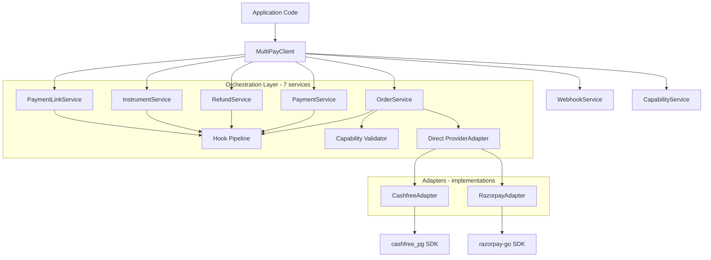
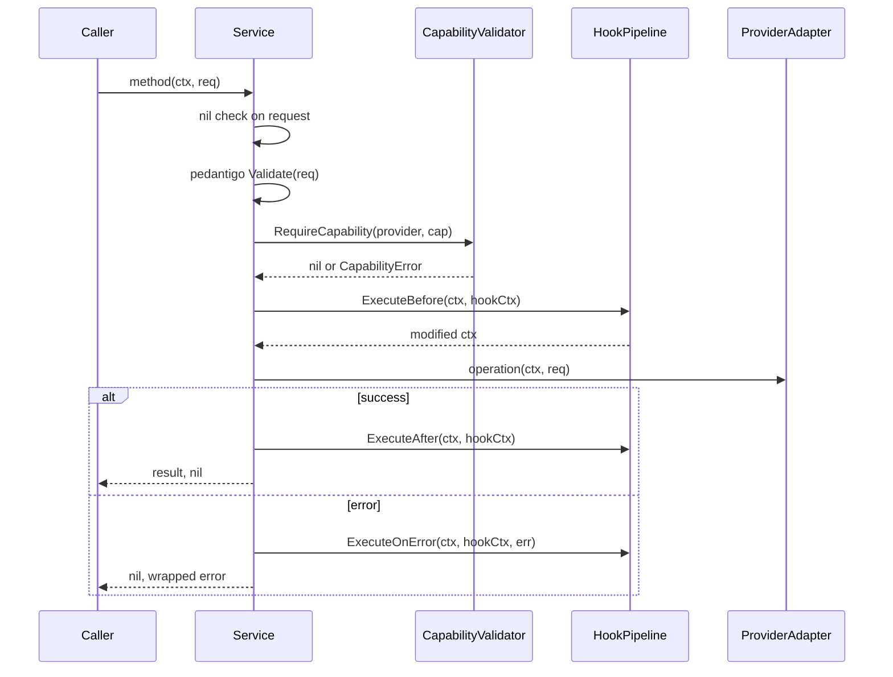
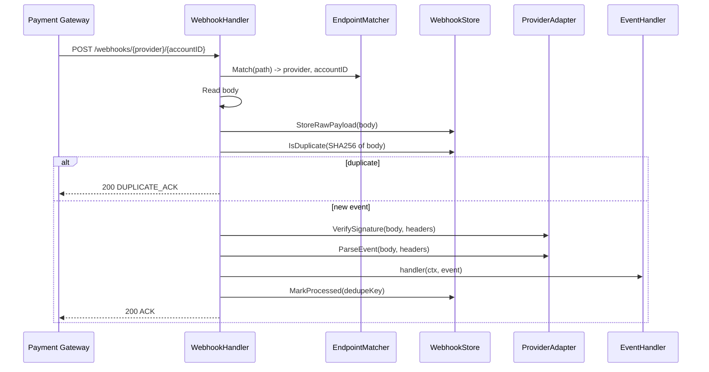

# CLAUDE.md — multipay-go

This file provides guidance to Claude Code when working in the **`multipay-go` Go library**
(`github.com/Bytonomics/multipay-india/multipay-go`). It is the authority for this port's architecture,
build, linting, and rules. For the multi-language monorepo overview and cross-language contract rules,
see the umbrella [`../CLAUDE.md`](../CLAUDE.md) and [`../README.md`](../README.md).

## What This Project Is

MultiPay Adapter (`github.com/Bytonomics/multipay-india/multipay-go`) is a Go library that provides a single, consistent API
for integrating Indian payment providers (Cashfree PG and Razorpay). Each client is bound to one provider at
construction time. Applications use the same API regardless of which provider is configured, and handle webhooks
with built-in deduplication and signature verification.

The library is a **dependency** (imported by other Go projects), not a standalone service.

---

## Build, Test, and Lint Commands

**Never run `go` commands directly. Always use Makefile targets.**

```bash
make help                    # Show all targets with descriptions
make check                   # Full pre-commit sequence: format -> build-check -> lint -> test-run
make build                   # Compile library (go build ./...)
make build-check             # Verify production + unit + integration code compiles
make test-run                # Run all unit tests (verbose, output to test-outputs/)
make test-run RUN=TestMyFunc # Run a single test by name
make lint                    # Run all linters (golangci-lint with NilAway, goimports, gci)
make format                  # Auto-format code (gofmt, goimports, gci)
make unit-test-coverage      # Unit tests with coverage + race detector (pre-commit hook)
make coverage-html           # Generate HTML coverage report
make mod-tidy                # Tidy go.mod and go.sum
make clean                   # Remove build artifacts and test cache
```

> `RUN` is passed unquoted to `go test -run`, so do NOT use a `|` regex there (the shell splits it into
> separate commands). Run one test by exact name, or run the whole suite with plain `make test-run`.

### Pre-commit Hooks

Pre-commit runs 4 hooks in order: gitleaks (secrets) -> build-check -> lint -> unit-test-coverage.

---

## Architecture

### Hexagonal Architecture with Hook Pipeline



### Package Dependency Flow

```
client/          -> Entry point. Creates MultiPayClient, wires all dependencies.
                    Only package users import directly.

orchestration/   -> Business logic services (OrderService, PaymentService, etc.)
                    Depends on: ports/, capabilities/, hooks/, domain/

hooks/           -> Hook pipeline (Before/After/OnError execution with panic recovery)
                    Built-in: AuditHook, MetricsHook
                    Depends on: ports/, domain/

capabilities/    -> SupportMatrix (immutable capability lookup), Validator
                    Depends on: domain/

routing/         -> WebhookHandler (http.Handler), EndpointMatcher, EndpointRegistry
                    Depends on: ports/, domain/

ports/           -> All interfaces: ProviderAdapter, Hook, WebhookStore, Logger, Clock
                    Depends on: domain/, capabilities/

domain/          -> Zero dependencies. Canonical types, enums, sentinel errors.

providers/       -> Concrete adapter implementations (cashfree/, razorpay/)
                    Each wraps its official SDK and maps responses to domain types.
```

### Request Flow Through Orchestration Services

Every service method follows this exact sequence:



### Webhook Processing Flow (8 Steps)



---

## Key Design Decisions

### Provider Interface Composition

`ProviderAdapter` is a composed interface embedding 7 sub-interfaces:

```
ProviderAdapter = OrderProvider + PaymentProvider + RefundProvider +
                  InstrumentProvider + PaymentLinkProvider +
                  WebhookConsumerProvider + MetadataMapper +
                  ProviderName() + ProviderCapabilities()
```

Each sub-interface is defined separately in `ports/providers.go` so consumers can depend on only what they need.

### Cashfree SDK Instance-Based Architecture

Cashfree SDK v6 uses an **instance-based architecture** with a `*Cashfree` struct (no package-level global variables).
Each adapter instance owns its own independent Cashfree client, ensuring full thread-safety. Multiple `MultiPayClient`
instances with different Cashfree adapters can coexist in the same process and be safely called concurrently by
different goroutines. No mutexes or synchronization primitives are needed.

### Capability Matrix Is Static

`SupportMatrix` is built once at client creation from hardcoded capability maps (verified against vendor SDK
documentation). It is **immutable** after construction -- no runtime mutations. The matrix includes explicit
`false` entries for capabilities a provider does NOT support, making the full picture visible.

### Hook Execution Order

- **Before:** FIFO (first registered, first executed). Context threads through all hooks.
- **After:** LIFO (last registered, first executed). Short-circuits on error.
- **OnError:** LIFO. All hooks execute even if some fail (no short-circuit). Errors logged, not propagated.
- All phases have **panic recovery** via `runtime/debug.Stack()`.

---

## Critical Rules

### Logger is Mandatory, Never Optional

All services and handlers that accept `ports.Logger` **MUST** enforce non-nil at construction time with a panic:

```go
if logger == nil {
    panic("logger is required (cannot be nil)")
}
wrappedLogger := logging.NewCallerLogger(logger, 2)
```

Never check `if s.logger != nil` in method bodies. Logger is always assumed non-nil after construction.

**Applied to:** All orchestration services, `WebhookHandler`, `AuditHook`, `MetricsHook`.

### Amounts Are Always Minor Units — Never Major Units

All monetary amounts in the library use `domain.AmountMinor` (`int64`) — the smallest unit of the currency (paisa, cents, fils). The conversion factor depends on the ISO 4217 exponent:

- **Exponent 0** (JPY, KRW, VND): `AmountMinor` = major unit value (no subdivision)
- **Exponent 2** (INR, USD, EUR, GBP): 100 minor = 1 major (`50000` = ₹500)
- **Exponent 3** (BHD, KWD, OMR): 1000 minor = 1 major (`500000` = 500 BHD)

**Rules for agents:**
- NEVER pass a major-unit value (like `500` for ₹500) as `AmountMinor` — that would be ₹5.00
- NEVER hardcode `/100` or `*100` for currency conversion — use `currencyutils.AmountMinorToMajor`/`currencyutils.AmountMajorToMinor` from `providers/cashfree/mappers.go` which use `bojanz/currency.GetDigits()` for the correct ISO 4217 exponent
- Razorpay API uses minor units natively — `AmountMinor` is passed directly, no conversion
- Cashfree API uses major units (float64) — the adapter converts using `currencyutils.AmountMinorToMajor(amount, currencyCode)`
- When constructing test data, always think in minor units: `AmountMinor: 50000` for ₹500, `AmountMinor: 500` for ¥500

### Error Handling

- Wrap all errors with `%w` to preserve call stacks
- Use sentinel errors from `domain/errors.go` (`ErrOrderNotFound`, `ErrProviderError`, etc.)
- Custom error types (`CapabilityError`, `ProviderAPIError`, `WebhookError`, `HookPanicError`) all implement `Unwrap()` returning the appropriate sentinel
- Check errors via `errors.Is()` for sentinels, `errors.As()` for typed errors
- Log OnError hook failures but don't propagate them

### Import Order

Enforced by gci: `stdlib -> external -> github.com/Bytonomics`

### Client Construction Contract

`client.ClientConfig` must bind the configured adapter directly:

```go
mpClient, err := client.NewClient(&client.ClientConfig{
    Provider:     cashfreeAdapter,
    WebhookStore: yourStore, // mandatory — NewClient panics if nil
    Logger:       yourLogger,
})
```

Rules:
- `Provider` is the `ports.ProviderAdapter` implementation
- Provider identity is derived internally via `cfg.Provider.ProviderName()`
- `WebhookStore` is mandatory — `NewClient` panics if nil (durable capture for dedup + replay)
- Request structs and service methods must remain provider-free
- Use `domain.EnvironmentSandbox` (`"SANDBOX"`) / `domain.EnvironmentProduction` (`"PRODUCTION"`) for provider configs — values are UPPERCASE

### Typed Structs, Never Maps

Build SDK requests and internal payloads with typed structs — never `map[string]interface{}`. The ONLY exception is decoding a raw vendor response body at the boundary, then immediately mapping it to a typed domain struct.

### Request Validation via pedantigo

#### Rule V1 — `Validate()` MUST run before every outbound provider call

Every orchestration service method MUST call its module-level validator as the **first step after the nil
check, before building or sending anything to a provider SDK**:

```go
var createPlanValidator = pedantigo.New[domain.CreatePlanRequest]()

func (s *PlanService) CreatePlan(ctx context.Context, req *domain.CreatePlanRequest) (*domain.Plan, error) {
    if req == nil {
        return nil, fmt.Errorf("request cannot be nil: %w", domain.ErrInvalidRequest)
    }
    if err := createPlanValidator.Validate(req); err != nil { // <-- MUST be here, before any adapter call
        return nil, fmt.Errorf("request validation failed: %w", err)
    }
    // ... capability check, hooks, adapter call ...
}
```

This is the **single validation boundary**: an adapter must never be reached with an unvalidated request, so
only compliant structures ever leave for Cashfree / Razorpay. Every existing service method follows this; any
new service method or request type MUST too. Adapters (`providers/*/`) are internal and are reached only via the
orchestration services — do not treat a direct adapter call as a supported entry point.

`pedantigo.New[T]().Validate(req)` runs the `pedantigo:""` field constraints **and** invokes the request type's
custom `Validate() error` method. Note: `Validate()` does NOT enforce the `required` tag (pedantigo only enforces
`required` during `Unmarshal()`), so mandatory presence is checked explicitly inside the custom `Validate()`.

#### Rule V2 — where each kind of rule lives

| Rule kind | Where it goes |
|---|---|
| **Field format** (`url`, `iso4217`, `email`, `oneof`, `gt`, `minLength`, …) | `pedantigo:""` struct tag |
| **Mandatory presence + cross-field** (non-empty, non-nil pointer, exactly-one-of, at-least-one) | a custom `func (r *XxxRequest) Validate() error` method — checked explicitly (`if r.X == "" { return errors.New("x is required") }`, `if r.Ptr == nil { … }`), because `.Validate()` does not honor `required` |
| **Provider-specific mandatory** (required by ONE vendor only — e.g. Cashfree `customer_email`, Razorpay refund `payment_id`) | enforced inside that provider's **adapter**, NOT the shared `Validate()`, so the other provider is not wrongly rejected. Document it on the field with a comment naming the vendor. |
| **Optional payload** fields | mapped with conditional `if non-empty { … }` guards inside the adapters |

Inline/nested requests delegate to the nested type's `Validate()` (single source of truth), e.g.
`CreateSubscriptionRequest.Validate()` calls `PlanDetails.Validate()` when an inline plan is provided.

#### Rule V3 — test pattern: `Validate()` for mandatory, adapter capture for optional

- **Mandatory + cross-field rules** are tested by calling the request's `Validate()` directly, **table-driven**,
  in `domain/validation_test.go` using `{name, req, wantErr, errMsg}` cases (e.g. `TestCreateOrderRequest_Validate`,
  `TestCreateSubscriptionRequest_Validate`, `TestListRefundsRequest_Validate`). Every new request type with
  mandatory/cross-field rules adds a case here.
- **Optional-field mapping and provider-specific behavior** are tested with **adapter outbound-capture** tests that
  inspect the exact request body / URL sent to the SDK (capture `req.Body`/`req.URL` in the `http.RoundTripper`
  stub) — e.g. `TestCreateOrder_SendsOrderMeta`, `TestListRefunds_UsesPaymentScopedEndpoint`.
- Tests use plain `t.Error`/`t.Fatal` (no testify); the `http.RoundTripper` stub is the legitimate transport mock.

### Webhooks Always Return 2xx

After signature verification, the webhook endpoint MUST return 2xx — even when an event handler errors. Log it and leave the event persisted-but-unprocessed for replay; never return 5xx (vendors auto-disable endpoints on repeated 5xx).

---

## Linter Configuration

The project uses a **custom golangci-lint binary** with NilAway (Uber's nil panic detector). Key linters enabled:

| Tier | Linters |
|------|---------|
| Nil detection | `nilaway`, `nilerr`, `nilnesserr`, `nilnil` |
| Bug detection | `errorlint`, `bodyclose`, `errchkjson`, `exhaustive`, `gosec`, `gocritic` |
| Performance | `prealloc`, `perfsprint`, `unconvert` |
| Context/Spans | `contextcheck`, `noctx`, `spancheck` |
| Error wrapping | `wrapcheck` |

**`fatcontext` is intentionally disabled** -- it causes auto-fix to convert `=` to `:=`, introducing variable shadowing in `hooks/pipeline.go`.

**`govet` has `shadow` enabled** -- variable shadowing is a lint error.

Additional hard rules live in [`.claude/rules/golang_code_rules.md`](./.claude/rules/golang_code_rules.md)
(no unhandled errors; close HTTP response bodies via defer).

---

### DESIGN.md Must Stay in Sync

`DESIGN.md` is the architecture reference for this library. Any change to interfaces, service signatures, error types, hook behavior, capability matrix, webhook flow, or currency conversion MUST be reflected in DESIGN.md in the same commit. Do NOT defer documentation updates — stale DESIGN.md is worse than no DESIGN.md because it actively misleads.

**Specifically update DESIGN.md when changing:**
- `ports/providers.go` — ProviderAdapter interface composition
- `domain/errors.go` — sentinel errors or typed error structs
- `domain/provider_details.go` — provider-specific detail struct schemas
- `orchestration/*.go` — service method signatures or pipeline flow
- `orchestration/webhooks.go` — the 8-step webhook flow
- `hooks/pipeline.go` — hook execution order (FIFO/LIFO)
- `client/client.go` — DI construction flow
- `capabilities/matrix.go` — provider capability entries
- `providers/cashfree/mappers.go` — currency conversion logic, provider detail mapping

---

### Webhook URL Convention

The library uses the URL pattern `/webhooks/{provider}/{accountID}`:
- The user registers this URL in the provider's dashboard (Cashfree/Razorpay)
- `provider` matches `domain.ProviderCashfree` or `domain.ProviderRazorpay`
- `accountID` is a user-chosen identifier for multi-account support (e.g., "prod", "sandbox", "merchant_123")
- `EndpointRegistry` tracks registered provider+account pairs and rejects unknown endpoints
- `WebhookHandler` (in `routing/http_handler.go`) implements `http.Handler` and can be mounted on any Go HTTP router

When writing code or examples, always use typed constants (`domain.ProviderCashfree`) not string literals (`"cashfree"`).

---

## Adding a New Provider

1. Create `providers/<name>/adapter.go` implementing `ports.ProviderAdapter`
2. Create operation files: `orders.go`, `payments.go`, `refunds.go`, `instruments.go`, `payment_links.go`, `webhooks.go`
3. Create `mappers.go` for SDK type -> domain type conversion
4. Create `metadata.go` implementing `ports.MetadataMapper`
5. Add capability entries to `capabilities/matrix.go` in `NewSupportMatrix()`
6. Register in `client/client.go` via `ClientConfig.Provider`

### Adding a New Orchestration Service Method

Follow the exact pattern in `orchestration/orders.go:CreateOrder`:
1. Nil check on request
2. **Validate the request via its module-level pedantigo validator (Rule V1) — before anything else touches a provider**
3. Capability validation via `s.validator.RequireCapability()`
4. Build `HookContext` with `RequestType`, `RequestData`, `StartTime`
5. Execute before hooks
6. Call adapter method (via `s.adapter`)
7. On error: set `hookCtx.Error`, execute OnError hooks, return wrapped error
8. On success: set `hookCtx.ResponseData`, execute after hooks, return result
