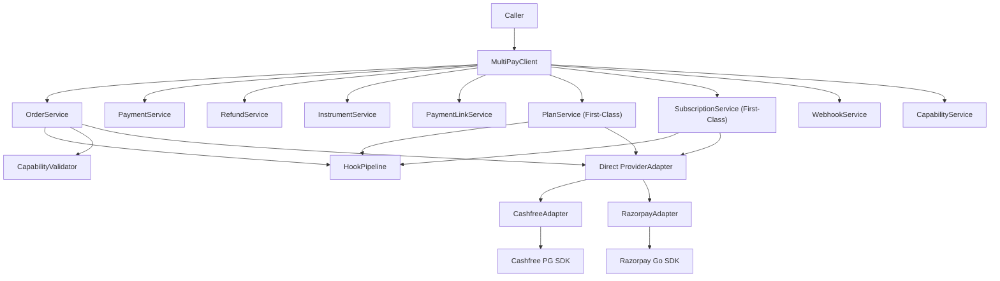
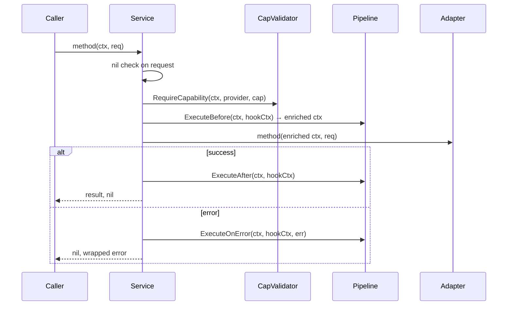
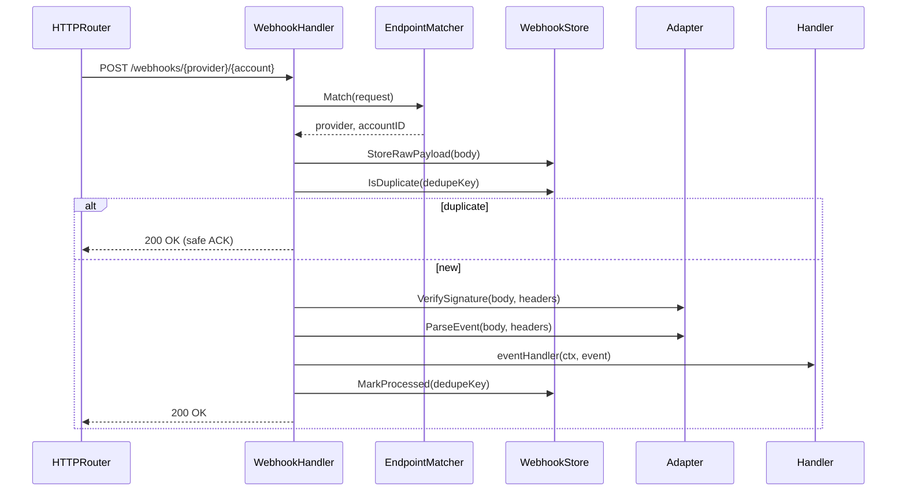
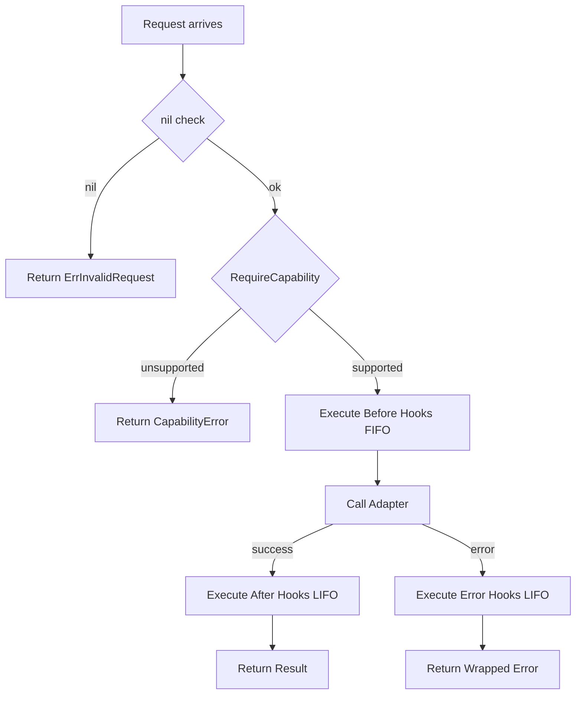
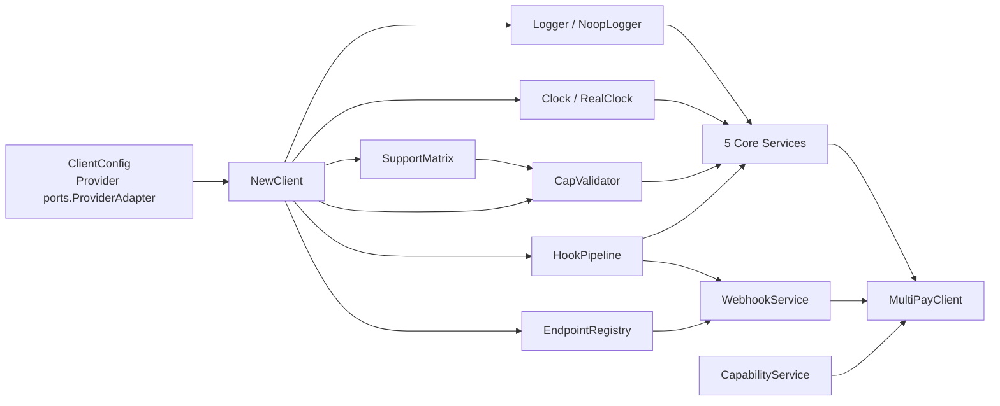

# MultiPay Adapter — Design Document

This document describes the architecture, design decisions, and core concepts of the MultiPay Adapter library.

## Architecture Overview



**Explanation**: The MultiPayClient is the main entry point that callers interact with. It wraps 9 orchestration services bound to a single payment provider adapter (Cashfree or Razorpay) specified at client construction time:

- **7 Capability-Gated Services**: Orders, Payments, Refunds, Instruments, Payment Links, Webhooks, Capabilities — require capability validation
- **2 First-Class Services**: Plans, Subscriptions — no capability validation, both providers fully support all operations

Each service uses a consistent pipeline of hooks and direct adapter calls. These adapters wrap the official SDKs from each provider.

## Hook Pipeline Flow



**Explanation**: Every service method follows a consistent, predictable flow:

1. **Input Validation**: Request nil check
2. **Capability Check**: The provider's capability is verified via `capabilities.Validator`
3. **Before Hooks (FIFO)**: Registered before-hooks execute and may enrich the context (e.g., trace IDs)
4. **Provider Call**: The adapter method is invoked with the enriched context
5. **After Hooks (LIFO)**: On success, after-hooks execute in reverse registration order
6. **Error Hooks (LIFO)**: On failure, error-hooks execute in reverse order; errors are logged but not propagated
7. **Return**: Result or wrapped error is returned to caller

All services share the same `Adapter`, `Validator`, `Pipeline`, `Logger`, and `Clock` instances, injected at construction via `client.NewClient()`.

## Plans and Subscriptions — First-Class Services

Plans and Subscriptions are **first-class services** on both Cashfree and Razorpay. Unlike capability-gated services (Orders, Payments, Refunds, Instruments, Payment Links), Plans and Subscriptions do NOT require capability validation — both providers fully support all operations.

### Subscription AuthLink Population (Cashfree)

The canonical `domain.Subscription.AuthLink` field holds the session ID that the Cashfree JS SDK uses for the mandate authorization step. During mapping via `MapSubscriptionEntityToCanonical()`, the adapter populates `AuthLink` from the Cashfree response field `SubscriptionSessionId`:

```go
// Cashfree returns the mandate-authorization handle as the subscription session id
// (used by the Cashfree JS SDK for the auth step); map it to the canonical AuthLink.
authLink := StringPtrToStr(entity.SubscriptionSessionId)
```

This is the handle a frontend must pass to the Cashfree JS SDK to initiate mandate authorization. For Razorpay, the equivalent field (if any) may differ — refer to the Razorpay adapter's mapper for its specific mapping logic.

### Supported Operations

| Operation | Cashfree | Razorpay | First-Class |
|-----------|----------|----------|------------|
| CreatePlan | ✓ | ✓ | YES |
| GetPlan | ✓ | ✓ | YES |
| CreateSubscription | ✓ | ✓ | YES |
| GetSubscription | ✓ | ✓ | YES |
| CancelSubscription | ✓ | ✓ | YES |
| PauseSubscription | ✓ | ✓ | YES |
| ResumeSubscription | ✓ | ✓ | YES |
| ChangePlan | ✓ | ✓ | YES |
| GetSubscriptionPayments | ✓ | ✓ | YES |

### Service Flow (No Capability Gate)

First-class services follow the same hook pipeline as capability-gated services, **except** they skip capability validation:

```
Caller
 → Service.CreatePlan(ctx, req)
   → nil check on req
   → pedantigo validation (cached module-level validator)
   → build HookContext{Provider, RequestType, RequestData, StartTime}
   → ExecuteBefore(ctx, hookCtx)
   → adapter.CreatePlan(ctx, req)
   → on success: set hookCtx.ResponseData, ExecuteAfter, return result
   → on error: set hookCtx.Error, ExecuteOnError, return wrapped error
```

The absence of `RequireCapability()` distinguishes first-class services from capability-gated ones.

### Request Validation via Pedantigo

All plan and subscription request structs use **pedantigo** for validation:

```go
var (
    createPlanValidator = pedantigo.New[domain.CreatePlanRequest]()
    getPlanValidator    = pedantigo.New[domain.GetPlanRequest]()
    createSubscriptionValidator = pedantigo.New[domain.CreateSubscriptionRequest]()
    // ... 4 more subscription validators
)
```

Module-level validators are created once and cached for performance. Validation is called immediately after nil checks:

```go
if err := createPlanValidator.Validate(req); err != nil {
    return nil, fmt.Errorf("request validation failed: %w", err)
}
```

### Provider-Specific Behaviors

**Cashfree SDK v6**:
- Plans: `SubsCreatePlanWithContext`, `SubsFetchPlanWithContext`
- Subscriptions: `SubsCreateSubscriptionWithContext`, `SubsFetchSubscriptionWithContext`, `SubsManageSubscriptionWithContext(action)`
  - Actions: `CANCEL`, `PAUSE`, `ACTIVATE` (resume), `CHANGE_PLAN`
  - **Note**: ChangePlan always applies at next billing cycle; ScheduleAt=NOW generates a warning

**Razorpay v1.4.1**:
- Plans: `Plan.Create`, `Plan.Fetch`
- Subscriptions: `Subscription.Create`, `Subscription.Fetch`, `Subscription.Cancel`, `Subscription.Pause`, `Subscription.Resume`, `Subscription.Update`
  - **Note**: CreateSubscription auto-creates a plan if PlanDetails is provided (2-step SDK call internally)
  - Update supports `schedule_change_at` ("now" or "cycle_end")

### Webhook Events for Subscriptions

Both adapters extend their `ParseEvent()` to handle subscription webhook events:

**Cashfree**: Uses `SUBSCRIPTION_STATUS_CHANGED` as catch-all type, disambiguates via `status` field in payload
- Supported statuses: `ACTIVE`, `ON_HOLD`, `PAUSED`, `CANCELLED`, `CUSTOMER_CANCELLED`, `CUSTOMER_PAUSED`, `COMPLETED`, `SUBSCRIPTION_AUTH_STATUS`, `SUBSCRIPTION_PAYMENT_SUCCESS`, `SUBSCRIPTION_PAYMENT_FAILED`, `SUBSCRIPTION_CARD_EXPIRY_REMINDER`, `SUBSCRIPTION_REFUND_STATUS`

**Razorpay**: Uses explicit event names (lowercase)
- Supported events: `subscription.authenticated`, `subscription.activated`, `subscription.charged`, `subscription.pending`, `subscription.halted`, `subscription.paused`, `subscription.resumed`, `subscription.cancelled`, `subscription.completed`, `subscription.updated`, `subscription.refund`

Both adapters populate the `Subscription` field in `domain.WebhookEvent` when the event is subscription-related.

## Webhook Routing Flow



**Explanation**: Webhook processing follows a robust 8-step flow designed for idempotency and reliability:

1. **Match Endpoint**: Extract provider and account ID from URL path
2. **Store Raw Payload**: Save the raw webhook body immediately for audit and recovery
3. **Check Duplicates**: Use a deduplication key (provider + transaction ID) to detect replayed webhooks
4. **Safe ACK for Duplicates**: If duplicate detected, immediately ACK with 200 OK (provider won't retry)
5. **Verify Signature**: Validate webhook signature using provider's public key
6. **Parse Event**: Deserialize the webhook body into a typed event struct
7. **Dispatch Handler**: Call the registered event handler with the parsed event
8. **Mark Processed**: Record successful processing in the deduplication store

This design ensures that even if a webhook is delivered multiple times, the handler is called exactly once.

### WebhookService API: Handler()

The `WebhookService` exposes a SINGLE, framework-agnostic webhook entry point. There is no per-framework
mount method by design — `http.Handler` is the universal Go HTTP contract, so one method serves every router.

#### Handler(basePath) http.Handler

`Handler()` returns the constructed `routing.WebhookHandler` as a plain `http.Handler`. Because every Go
router/framework accepts an `http.Handler`, this one method mounts on net/http, chi, Echo, Gin, Fiber, or
any other router — the library never grows a router-specific method (such as a `*http.ServeMux`-only helper).

```go
svc := client.WebhookService()
svc.RegisterHandler(domain.WebhookEventTypeOrderPaid, myOrderHandler)
svc.RegisterHandler(domain.WebhookEventTypePaymentFailed, myPaymentHandler)
handler := svc.Handler("/webhooks")  // a plain http.Handler — mount it on any router
```

**CRITICAL CONTRACT**: All `RegisterHandler()` calls MUST precede `Handler()` — handlers are snapshotted into the returned handler at construction time. Registering handlers after calling `Handler()` has no effect.

**Endpoint Matching**: The internal `EndpointMatcher` re-parses the FULL request path (`{basePath}/{provider}/{accountID}`), so the consumer's router MUST mount the handler on a **prefix/subtree route that does NOT strip the basePath prefix**:

- ✅ **net/http** (correct): `mux.Handle(basePath+"/", handler)` — the TRAILING SLASH makes `ServeMux` match the whole subtree (`{basePath}/{provider}/{account}`). A pattern WITHOUT the trailing slash (`mux.Handle(basePath, handler)`) matches ONLY the exact `basePath` and would 404 the real webhook URL.
- ✅ **chi** (correct): `r.Handle(basePath+"/*", handler)`
- ✅ **Echo** (correct): `e.Any(basePath+"/*", echo.WrapHandler(handler))` — does NOT strip the path
- ❌ **Echo** (wrong): `e.Group(basePath).Any("/*", handler)` — the group strips the prefix, breaking matching
- ✅ **Gin** (correct): `r.Any(basePath+"/*path", gin.WrapH(handler))`

Non-`*http.ServeMux` routers like Echo/Gin require their adapter (`echo.WrapHandler()` / `gin.WrapH()`) to wrap the plain `http.Handler`.

## Capability Matrix Decision Tree



**Explanation**: The capability matrix is a critical control point in the request flow:

- **Input Validation**: Request nil check runs first
- **Capability Check**: Every operation checks if the bound provider supports the requested capability via `capabilities.Validator`
- **Fail Fast**: Unsupported capabilities immediately return a `*domain.CapabilityError` (wraps `ErrUnsupportedCapability`), preventing wasted SDK calls
- **Graceful Degradation**: Callers can catch `CapabilityError` via `errors.As()` and fall back to alternative flows
- **Hook Ordering**: Before hooks run FIFO; After and OnError hooks run LIFO (middleware stack pattern)

The `SupportMatrix` is immutable after construction — built from hardcoded maps verified against vendor SDK documentation. It includes explicit `false` entries for unsupported capabilities.

## Dependency Injection and Construction Flow



**Explanation**: The MultiPayClient is constructed from a ClientConfig in a deterministic flow:

1. **Validate Config**: `Provider` (`ports.ProviderAdapter`) must be non-nil
2. **Default Logger/Clock**: If `cfg.Logger` is nil, use `ports.NewNoopLogger()`; if `cfg.Clock` is nil, use `ports.NewRealClock()`
3. **Create Support Matrix**: Static, immutable capability map for both Cashfree and Razorpay
4. **Create Capability Validator**: Uses the support matrix for early unsupported-capability errors
5. **Create Hook Pipeline**: Wraps configured hooks with panic recovery; accepts logger
6. **Create Endpoint Registry**: Maps webhook provider+account pairs to routes
7. **Create 5 Core Services**: OrderService, PaymentService, RefundService, InstrumentService, PaymentLinkService — all share the configured adapter, validator, pipeline, logger, clock
8. **Create WebhookService**: Takes the configured adapter, pipeline, store, endpoint registry, logger
9. **Create CapabilityService**: Thin wrapper around SupportMatrix
10. **Return Client**: The fully-constructed MultiPayClient with all 7 service accessors

## Core Design Principles

### 1. Canonical Types

All request and response types are defined once in the library and used everywhere. Providers return provider-specific types (e.g., Cashfree Order), which are immediately mapped to canonical types (Order) at the adapter boundary. This ensures consistent APIs across providers and simplifies testing.

### 2. Error Handling

- **Sentinel Errors**: Expected errors (e.g., OrderNotFound, RefundAlreadyProcessed) are sentinel errors that can be checked with `errors.Is()`
- **Provider Errors**: Provider-specific errors are wrapped in ProviderAPIError with the original error preserved
- **Capability Errors**: Unsupported capabilities return CapabilityError with details about which capability is unsupported
- **Validation Errors**: pedantigo validation errors are returned as-is with structured field-level errors

### 3. Deduplication and Idempotency

- **Webhook Deduplication**: Raw webhook payloads are stored and checked for duplicates before processing
- **Idempotent Operations**: All operations are safe to retry; duplicate requests return the same result
- **Atomic Commits**: All state updates (deduplication, audit logs, metrics) are committed atomically

### 4. Hook Pipeline

- **Before Hooks**: Execute before the provider call; useful for audit, metrics setup, and request transformation
- **After Hooks**: Execute after successful provider call; useful for audit, metrics recording, cache invalidation
- **Error Hooks**: Execute when the provider call fails; useful for error audit, alerting, and recovery
- **Built-in Hooks**: Audit hook (logs all operations), metrics hook (records latency and status)
- **Custom Hooks**: Callers can register custom hooks for observability, cache invalidation, or business logic

### 5. Provider Adapter Interface

`ProviderAdapter` is a composed interface embedding 7 sub-interfaces (defined in `ports/providers.go`):

```go
type ProviderAdapter interface {
    OrderProvider           // CreateOrder, GetOrder, ListOrderPayments
    PaymentProvider         // GetPayment, ListPayments, CapturePayment
    RefundProvider          // CreateRefund, GetRefund, ListRefunds
    InstrumentProvider      // GetInstrument, ListInstruments, DeleteInstrument
    PaymentLinkProvider     // CreatePaymentLink, GetPaymentLink, CancelPaymentLink
    WebhookConsumerProvider // VerifySignature(ctx, payload, headers), ParseEvent(ctx, payload, headers)
    MetadataMapper          // MapOrderMetadata, MapRefundMetadata, MapPaymentLinkMetadata

    ProviderName() domain.Provider
    ProviderCapabilities() []capabilities.Capability
}
```

All methods accept typed request structs from `domain/` (e.g., `*domain.CreateOrderRequest`) and return typed response structs (e.g., `*domain.Order`). Request structs and client methods do not carry a provider field; provider selection happens once at client construction via `ClientConfig.Provider`. Provider SDK types never leak outside adapters. Both adapters have compile-time interface checks: `var _ ports.ProviderAdapter = (*Adapter)(nil)`.

### 5.1 Provider-Specific Details Capture (Discriminated Union Pattern)

While canonical response types (Order, Payment, Refund, etc.) provide a consistent API surface across providers, each provider returns unique fields and metadata that would be lost in a generic schema. To preserve full queryability of provider-specific data without polluting the canonical types with union fields, we use a **discriminated union pattern** via nested provider-detail structs.

#### Architecture

Five main wrapper types in `domain/provider_details.go` capture provider-specific fields:

```go
type OrderProviderDetail struct {
    Cashfree *CashfreeOrderDetail
    Razorpay *RazorpayOrderDetail
}

type PaymentProviderDetail struct {
    Cashfree *CashfreePaymentDetail
    Razorpay *RazorpayPaymentDetail
}

type RefundProviderDetail struct {
    Cashfree *CashfreeRefundDetail
    Razorpay *RazorpayRefundDetail
}

type InstrumentProviderDetail struct {
    Cashfree *CashfreeInstrumentDetail
    Razorpay *RazorpayInstrumentDetail
}

type PaymentLinkProviderDetail struct {
    Cashfree *CashfreePaymentLinkDetail
    Razorpay *RazorpayPaymentLinkDetail
}
```

Each wrapper contains **exactly one non-nil pointer** — either Cashfree or Razorpay — depending on which provider processed the request. The other pointer is `nil`.

#### Integration with Canonical Types

Each canonical response type contains a `ProviderDetails` field:

```go
type Order struct {
    ProviderOrderID  string
    OrderID          string
    Status           OrderStatus
    AmountMinor      AmountMinor
    Currency         Currency
    Metadata         Metadata
    ProviderDetails  *OrderProviderDetail   // NEW: provider-specific fields
    Checkout         *CheckoutPayload       // NEW: canonical checkout session data
    Raw              RawProviderResponse
}

type Payment struct {
    ProviderPaymentID string
    OrderID          string
    Status           PaymentStatus
    AmountMinor      AmountMinor
    Currency         Currency
    PaymentMethod    string
    ProviderDetails  *PaymentProviderDetail  // NEW
    Raw              RawProviderResponse
}

// Similar for Refund, Instrument, PaymentLink
```

The `ProviderDetails` field is **optional** (`*`, omitempty in JSON) and is populated by the adapter during mapping.

#### Canonical Checkout Data

In contrast to `ProviderDetails` (which is provider-specific), the `Checkout` field holds **canonical checkout session data** that is consistent across all providers. This represents the unified checkout payload that would be sent to the frontend for rendering a checkout page:

```go
type Checkout struct {
    CheckoutSessionID string           // Canonical checkout session ID
    CheckoutPayload    CheckoutPayload  // Canonical checkout payload for frontend
    ExpiresAt         time.Time        // Checkout session expiration
}
```

The `CheckoutPayload` is **provider-agnostic** — it contains standardized checkout data (amount, currency, order metadata, payment methods) regardless of whether the underlying provider is Cashfree or Razorpay. This ensures the frontend receives a consistent checkout interface across all payment providers.

#### Provider-Specific Fields Captured

**Cashfree Order Details:**
- `CfOrderID` (*string), `Entity`, `OrderNote`, `OrderSplits` (vendor splits), `OrderMeta` (return URL, notify URL, payment methods)

**Razorpay Order Details:**
- `Entity`, `Receipt`, `OfferID`, `AmountPaid`, `AmountDue`, `Attempts`

**Cashfree Payment Details:**
- `CfPaymentID` (*string), `Entity`, `OrderAmount`, `OrderCurrency`, `PaymentMessage`, `AuthID`, `ErrorDetails` (code, description, reason, source)

**Razorpay Payment Details:**
- 15+ fields: `Entity`, `Description`, `Email`, `Contact`, `Fee`, `Tax`, `AmountRefunded`, `RefundStatus`, `International`, `CardID`, `Bank`, `VPA`, `Wallet`, `ErrorSource/Step/Reason`, plus `AcquirerData` (bank txn ID, auth code, RRN)

**Cashfree Refund Details:**
- `CfRefundID`, `CfPaymentID`, `Entity`, `RefundCharge`, `RefundType/Mode`, `StatusDescription`, `RefundSpeed`, `RefundSplits`, forex charges/tax, `ProviderMetadata` (arbitrary key-value)

**Razorpay Refund Details:**
- `Entity`, `Receipt`, `SpeedRequested/Processed`, `BatchID`, `AcquirerData`

**Similar patterns** for Instrument and PaymentLink details.

#### Mapping Flow

In each adapter's mapper functions (e.g., `providers/cashfree/mappers.go`):

```go
func MapOrderEntityToCanonical(ctx context.Context, entity *cashfree_pg.OrderEntity, ...) *domain.Order {
    return &domain.Order{
        ID:     entity.OrderId,
        Status: mapOrderStatus(entity.OrderStatus),
        // ... canonical fields ...
        ProviderDetails: &domain.OrderProviderDetail{
            Cashfree: &domain.CashfreeOrderDetail{
                CfOrderID:   entity.CfOrderId,
                Entity:      StringPtrToStr(entity.Entity),
                OrderNote:   StringPtrToStr(entity.OrderNote),
                OrderSplits: mapCashfreeVendorSplits(entity.OrderSplits),
                OrderMeta:   mapCashfreeOrderMeta(entity.OrderMeta),
            },
            Razorpay: nil,
        },
        Raw: rawBody,
    }
}
```

For Razorpay (untyped SDK), helpers extract fields from `map[string]interface{}`:

```go
func GetOrder(ctx context.Context, resp map[string]interface{}, ...) *domain.Order {
    return &domain.Order{
        // ... canonical fields ...
        ProviderDetails: &domain.OrderProviderDetail{
            Cashfree: nil,
            Razorpay: &domain.RazorpayOrderDetail{
                Entity:      getString(resp, "entity"),
                Receipt:     getString(resp, "receipt"),
                OfferID:     getString(resp, "offer_id"),
                AmountPaid:  getInt64(resp, "amount_paid"),
                AmountDue:   getInt64(resp, "amount_due"),
                Attempts:    getInt64(resp, "attempts"),
            },
        },
        Raw: rawBody,
    }
}
```

#### Benefits

1. **No Data Loss**: All provider-specific fields are captured in strongly-typed structs, not lost or merged into generic maps
2. **Queryability**: Applications can access `order.ProviderDetails.Cashfree.CfOrderID` or `order.ProviderDetails.Razorpay.Receipt` directly
3. **Type Safety**: No runtime type assertions needed; fields are declared with their correct Go types
4. **Backwards Compatibility**: The `ProviderDetails` field is optional; existing code that ignores it continues to work
5. **Clean Separation**: Provider-specific details don't pollute the canonical Order/Payment/Refund types; canonical types remain provider-neutral
6. **Exhaustive Capture**: Every non-standard field returned by the provider is captured; nothing is dropped

#### Testing

Mock adapters can return populated `ProviderDetails` for testing provider-specific logic:

```go
mockOrder := &domain.Order{
    ID:     "order_123",
    Status: domain.OrderStatusCreated,
    ProviderDetails: &domain.OrderProviderDetail{
        Cashfree: &domain.CashfreeOrderDetail{
            CfOrderID: newString("cf_order_abc"),
            Entity:    "order",
        },
        Razorpay: nil,
    },
}
```

### 6. Configuration and Multi-Account Support

- **ClientConfig**: Contains the bound `Provider` (`ports.ProviderAdapter`), optional hooks, webhook store, logger, and clock
- **Multi-Instance**: Multiple `MultiPayClient` instances can coexist in one process with different provider/account bindings
- **Thread-Safe**: No package-level mutable state. Each `MultiPayClient` owns its dependencies independently; Cashfree SDK v6 uses instance-based architecture with no globals
- **Webhook Segregation**: Separate endpoints per provider+account via `routing.EndpointRegistry`

### 7. Testing and Mocking

- **Interface-Based**: All components depend on interfaces, not concrete implementations
- **Mock Adapters**: A mock adapter implements the adapter interface and returns predictable test data
- **Mock Hooks**: Hooks can be mocked to verify that expected hooks were called
- **Mock Webhook Handlers**: Event handlers can be mocked to verify event routing

## Error Handling Strategy

### Sentinel Errors

All sentinel errors live in `domain/errors.go`. Each typed error wraps a sentinel via `Unwrap()`:

```go
var (
    ErrProviderNotFound          = errors.New("provider not found")
    ErrOrderNotFound             = errors.New("order not found")
    ErrPaymentNotFound           = errors.New("payment not found")
    ErrRefundNotFound            = errors.New("refund not found")
    ErrInstrumentNotFound        = errors.New("instrument not found")
    ErrPaymentLinkNotFound       = errors.New("payment link not found")
    ErrInvalidRequest            = errors.New("invalid request")
    ErrUnsupportedCapability     = errors.New("unsupported capability")
    ErrProviderError             = errors.New("provider error")
    ErrWebhookVerificationFailed = errors.New("webhook verification failed")
    ErrWebhookEventNotFound      = errors.New("webhook event not found")
    ErrHookPanic                 = errors.New("hook panic")
)
```

### Typed Error Structs

All typed errors implement `Error()` and `Unwrap()` returning the appropriate sentinel:

| Error Type | Wraps Sentinel | Key Fields |
|---|---|---|
| `*CapabilityError` | `ErrUnsupportedCapability` | `Provider`, `Capability string`, `Message` |
| `*ValidationError` | `ErrInvalidRequest` | `Field`, `Message` |
| `*ProviderAPIError` | `ErrProviderError` | `Provider`, `StatusCode int`, `ErrorCode`, `Message`, `RawBody []byte` |
| `*WebhookError` | `ErrWebhookVerificationFailed` | `Reason`, `Provider`, `AccountID` |
| `*HookPanicError` | `ErrHookPanic` | `Phase`, `Operation`, `PanicValue`, `StackTrace` |

```go
// Check sentinel
if errors.Is(err, domain.ErrOrderNotFound) { ... }

// Extract typed error
var capErr *domain.CapabilityError
if errors.As(err, &capErr) {
    log.Printf("Provider %s doesn't support %s", capErr.Provider, capErr.Capability)
}
```

## Webhook Deduplication

Webhooks are deduplicated using a `DedupeKey` generated by each provider's `ParseEvent()`:

- **Cashfree**: `DedupeKey = event_id` from the webhook payload
- **Razorpay**: `DedupeKey = event_id` from the webhook payload
- **Fallback** (routing layer): SHA256 hash of the raw body when `DedupeKey` is empty

The `ports.WebhookStore` interface (implemented by the consumer) provides:

1. **StoreRawPayload(ctx, provider, accountID, payload)**: Persist raw body for audit (ledger-first)
2. **IsDuplicate(ctx, provider, accountID, dedupeKey)**: Check if event was already processed
3. **MarkProcessed(ctx, provider, accountID, dedupeKey)**: Record successful processing

Duplicate webhooks receive a 200 ACK immediately — the provider won't retry.

## Thread Safety

All components are fully thread-safe:

- **MultiPayClient**: Can be shared across goroutines
- **Services**: All methods are safe to call concurrently
- **Adapters**: All methods are safe to call concurrently — each adapter maintains its own independent instance of the provider client (Cashfree SDK v6 uses instance-based architecture)
- **Hooks**: Hook handlers are called serially within a single request, but multiple requests are handled concurrently
- **Webhook Handler**: Safe to call from multiple HTTP handler goroutines

There are no global variables or shared mutable state. Each MultiPayClient owns its dependencies, and dependencies do not share state. Cashfree SDK v6 uses an instance-based `*Cashfree` struct (no package-level globals), eliminating the need for mutexes.

## Observability

The library provides built-in observability via hooks and structured logging:

1. **AuditHook** (`hooks/audit.go`): Logs operation start/complete/failure with provider and duration
2. **MetricsHook** (`hooks/metrics.go`): Records operation metrics via a `MetricsCollector` interface (consumer-implemented)
3. **CallerLogger** (`logging/caller_logger.go`): Wraps `ports.Logger` to automatically prepend `[file:line function]` to all log messages
4. **Custom Hooks**: Callers can implement `ports.Hook` (Before/After/OnError) for additional observability
5. **Panic Recovery**: All hook phases have `defer recover()` with full stack traces logged via `HookPanicError`

Logger is mandatory (panics on nil at construction). All log methods accept `context.Context` for trace correlation.

## Security Considerations

1. **Webhook Signature Verification**: HMAC-SHA256 verification per provider (Cashfree uses `X-Cashfree-Signature`, Razorpay uses `X-Razorpay-Signature`); constant-time comparison via `crypto/subtle`
2. **Credential Isolation**: Provider credentials are never logged; `CallerLogger` only adds caller location, not request data
3. **Provider Client Architecture**: Cashfree SDK v6 uses instance-based `*Cashfree` struct (no package-level globals); each adapter instance owns its client, ensuring thread-safe concurrent calls without mutexes
4. **POST-Only Webhooks**: `WebhookHandler.ServeHTTP` rejects non-POST requests with 405
5. **Signature vs Other Errors**: Webhook handler differentiates `ErrWebhookVerificationFailed` (400) from other errors (500) via `errors.Is()`

## Currency Conversion

Amount conversion between minor units (`AmountMinor int64`) and provider major units uses ISO 4217 exponents via `bojanz/currency`:

- **Exponent 0** (JPY, KRW, VND): factor = 1 — no conversion
- **Exponent 2** (INR, USD, EUR): factor = 100
- **Exponent 3** (BHD, KWD, OMR): factor = 1000

Conversion functions in `utils/currencyutils/currency.go`:
- `currencyutils.AmountMinorToMajor(minorAmount int64, currencyCode string) float64` — outbound to Cashfree
- `currencyutils.AmountMajorToMinor(majorAmount float64, currencyCode string) int64` — inbound from Cashfree

Razorpay uses minor units natively — no conversion needed.
